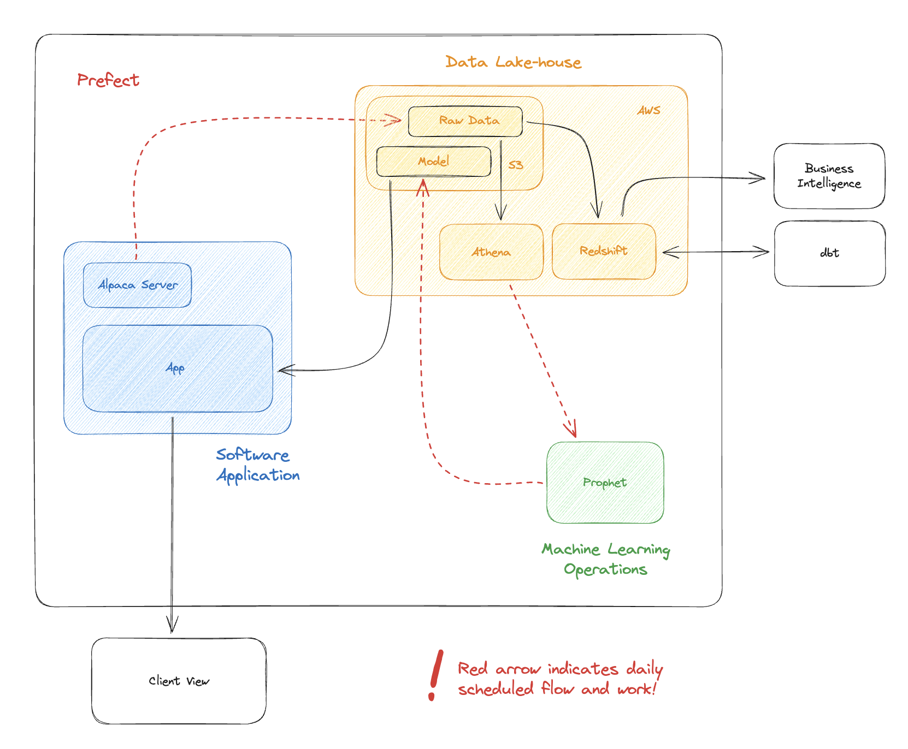

---

Include stocks data from:

1. S&P 500
2. NASDAQ 100

---

Roadmap:

1. Orchestrate batch data processing from API to S3 in Prefect
2. Store 6 years worth of historical data in S3
3. Deploy Prefect in Docker/Kubernetes infra
4. Run transformation queries in Redshift and dbt
5. Pull transformed data from Redshift, and process ML training and evaluation. Save the model to S3
6. Orchestrate ML operations in Prefect
7. Create a Flask app to showcase forecasting
8. Deploy the app
